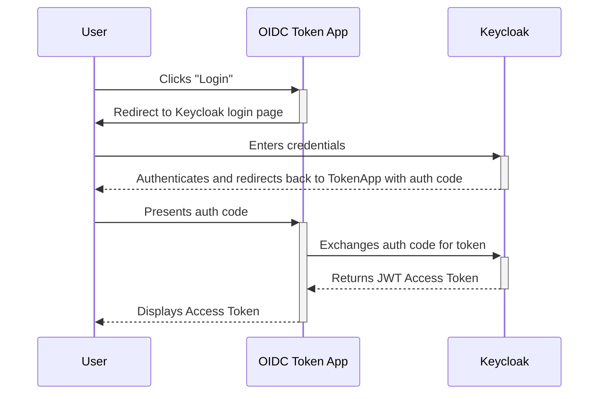

# OIDC Token Fetcher

This is a simple Streamlit web application to help users obtain a JWT (JSON Web Token) from the OIDC provider (Keycloak) used in this project.

## How it Works

The application uses the OIDC Authorization Code Flow, which is the standard and most secure method for web applications.

1.  A user clicks the "Login" button.
2.  They are redirected to the Keycloak login page.
3.  After a successful login, Keycloak redirects them back to this application with a temporary authorization code.
4.  The application exchanges this code for a JWT.
5.  The application displays the JWT (access token) to the user, allowing them to copy it for use with the LLM Gateway.

This process is secure because this application never handles the user's password.

## Auth Flow Diagram



## Dependencies

The application requires the following Python libraries:

*   `streamlit`
*   `authlib`

These can be installed from the `requirements.txt` file.

## Configuration

The application is configured using Streamlit's secrets management. Create a file named `.streamlit/secrets.toml` in this directory with the following content:

```toml
[connections.keycloak]
server_metadata_url = "http://localhost:8180/realms/master/.well-known/openid-configuration"
client_id = "my-client"
client_secret = "your-client-secret" # Only if your client is confidential
redirect_uri = "http://localhost:8501/oauth2callback"
```

Then, run the application:
```bash
streamlit run app.py
```
